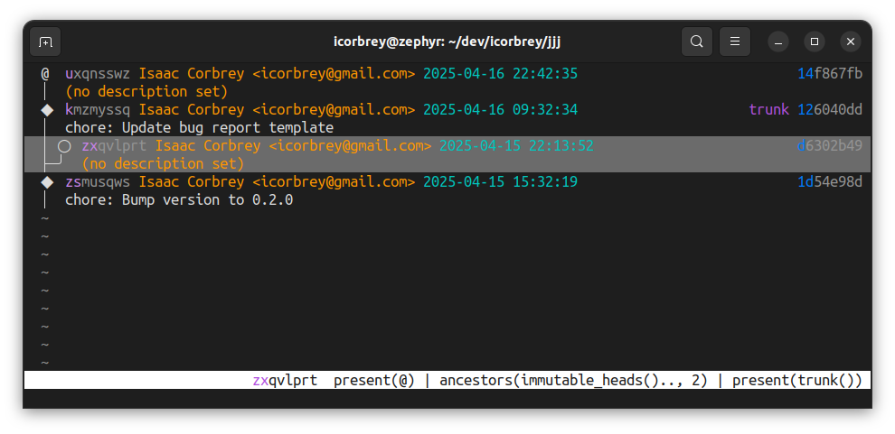

# `jjj`

[](https://crates.io/crates/jjj)
[](https://crates.io/crates/jjj)

A modal interface for [Jujutsu](https://jj-vcs.github.io/jj), inspired by the utility
of [Lazygit](https://github.com/jesseduffield/lazygit) and the powerful interface of
[Helix](https://helix-editor.com/).



## ✨ Installation

```sh
# Make sure Jujutsu is installed
cargo install jj-cli

# Install jjj
cargo install jjj
```

## ✳️ Features

<sup>
  🌳 Mature feature &nbsp;&centerdot;&nbsp;
  🌱 New feature    &nbsp;&centerdot;&nbsp;
  🔜 Coming soon
</sup>

- 🌱 View the current output of `jj log`
- 🌱 Auto-refresh the log to keep up with external changes
- 🌱 Switch the view's revset on the fly with `<space>r`
- 🌱 Configure `jjj` through `jj config set jjj.[key] [value]`
- 🔜 Convert uninitialized folders and Git repositories into Jujutsu
  repositories
- 🔜 Create new commits
- 🔜 Abandon existing commits
- 🔜 Modify the description on existing commits

And more to come!

## 🛠️ Contributing

Clone the repository locally and build.

```sh
jj git clone https://github.com/icorbrey/jjj.git
cd jjj
cargo dev
```

## 📐 Architecture

`jjj` runs as a minimal [Bevy](https://bevyengine.org) app that renders to the
terminal with [Ratatui](https://ratatui.rs). It interfaces with Jujutsu via shell
commands, meaning you do need to have Jujutsu installed first.

There are three primary modules:

- **`backend`**: Handles interactions with underlying Jujutsu repositories.
- **`frontend`**: Handles user interaction and rendering at the component level.
- **`screens`**: Coordinates rendering logic for various screens.

## ⚖️ License

`jjj` is distributed under the [MIT license](./LICENSE.md).
